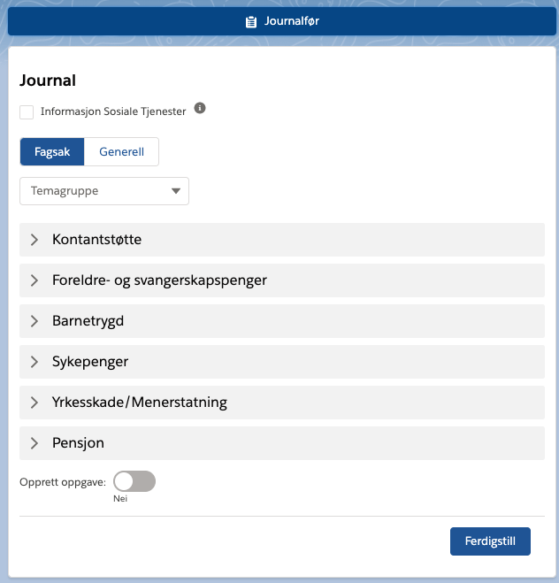
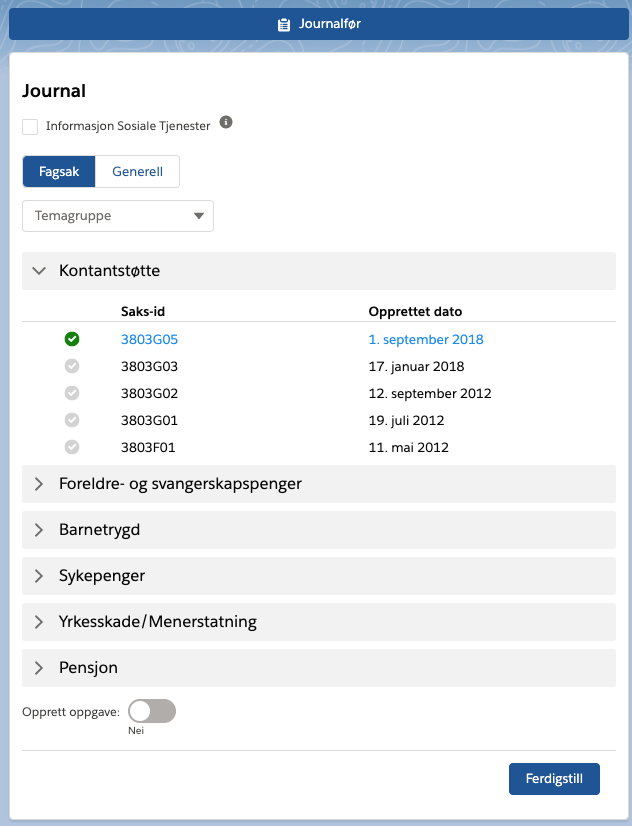

## LWC: NAV Case List

LWC for displaying a users cases with NAV and allowing selection to be used in the flow for journal entry creation. This component also hosts the nksThemeCategorization component when selecting case type "GENERELL_SAK".

## Attributes

| Name                   | Type   | Access | Required | Description                                                                                                                 |
| :--------------------- | :----- | :----- | :------- | :-------------------------------------------------------------------------------------------------------------------------- |
| actorId                | String | global | true     | Unique actor id for the person                                                                                              |
| prefilledThemeGroup    | String | global | false    | Optional preselected theme group for quick filtering                                                                        |
| selectedCaseId         | String | global | false    | The legacy system case id of the selected case (Outputonly)                                                                 |
| selectedCaseTheme      | String | global | false    | The theme code of the selected case (Outputonly)                                                                            |
| navCaseType            | String | global | false    | The selected case type (GENERELL_SAK or FAGSAK) (Outputonly)                                                                |
| selectedSubtheme       | String | global | false    | The selected subtheme from the component (Only valid for GENERELL_SAK type)(Outputonly)                                     |
| selectedSubthemeSfId   | String | global | false    | The selected subtheme (Common_Code\_\_c) Salesforce ID from the component (Only valid for GENERELL_SAK type)(Outputonly)    |
| selectedCaseThemeSfId  | String | global | false    | The selected theme (Common_Code\_\_c) Salesforce ID from the component (Only valid for GENERELL_SAK type)(Outputonly)       |
| selectedThemeGroupSfId | String | global | false    | The selected theme group (Common_Code\_\_c) Salesforce ID from the component (Only valid for GENERELL_SAK type)(Outputonly) |

## Usage

The component displays a list of existing cases a person has with NAV. The user is then allowed to select a case for relating a journal entry to.

