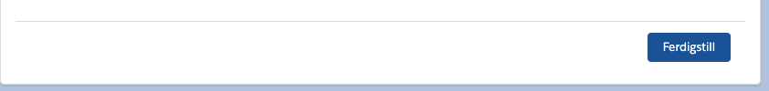

## LWC: Flow Navigation

LWC component utiliizing the [flowSupport module](https://developer.salesforce.com/docs/component-library/bundle/lightning-flow-support/documentation) to allow flow navigation with custom labeled buttons and button alignment.

## Attributes

The input attrbitues have not been given the "datasource" property in the js-meta.xml file as this is not supported in flows and causes the input property not to render.

| Name            | Type    | Access | Required | Description                                                                  |
| :-------------- | :------ | :----- | :------- | :--------------------------------------------------------------------------- |
| action          | String  | global | true     | Type of flow navigation action to be trigger on click (NEXT, BACK or FINISH) |
| buttonLabel     | String  | global | true     | Label shown on the button (Custom label support in flow builder)             |
| buttonAlignment | String  | global | true     | How the button aligns in the flow screen (RIGHT, LEFT or CENTER)             |
| stretched       | Boolean | global | true     | If set to true, the button is stretched to the full width of its container.  |

