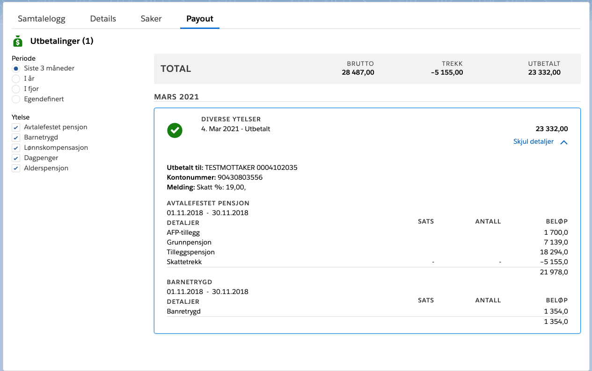

## LWC: Person Payment List

LWC for displaying the payouts to a NAV user.

## Attributes

| Name              | Type   | Access | Required | Description                                                                                                                                        |
| :---------------- | :----- | :----- | :------- | :------------------------------------------------------------------------------------------------------------------------------------------------- |
| relationshipField | String | global | true     | API name of the field to relating the parent object to a Person\_\_c (Can also be relationship field as for i.e. Case --> Account.CRM_Person\_\_c) |

## Usage

The component displays a list of payments for a given user retrievet via API (Utbetaling). The component consists of the following component hierarchy:

-   nksPersonPaymentList
    -- nksPaymentTotals
    -- nksPayment
    --- nksPaymentDetails
    
