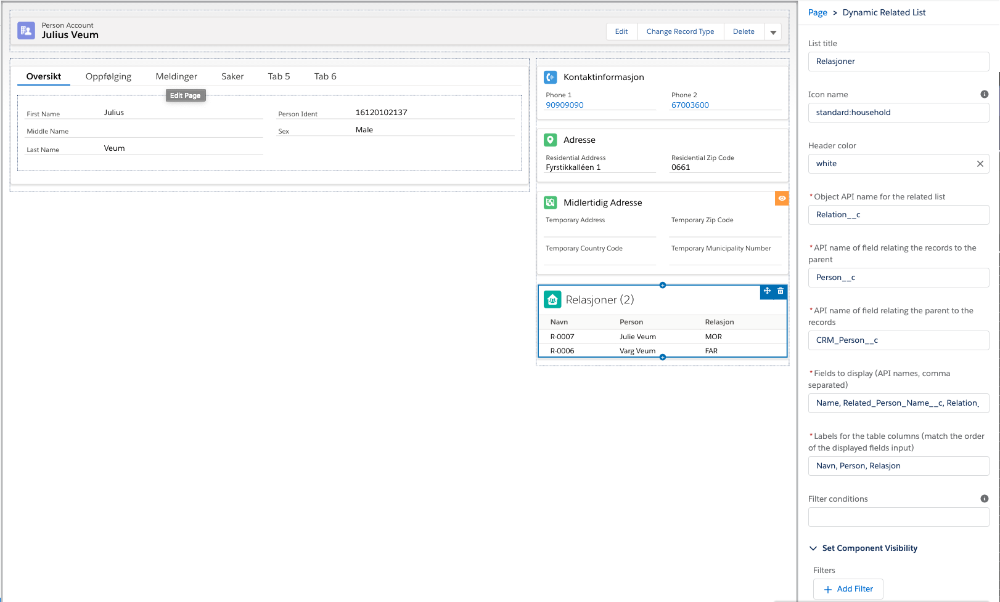

## LWC: Dynamic Related List

LWC for displaying a related list with filter options based on inputs defined in js-meta.xml.

## Attributes

| Name                 | Type   | Access | Required | Description                                                                                                                                            |
| :------------------- | :----- | :----- | :------- | :----------------------------------------------------------------------------------------------------------------------------------------------------- |
| listTitle            | String | global | false    | Title of the list to be displayed in the header section                                                                                                |
| iconName             | String | global | false    | Icon name on the format required from standard [lightning-icon](https://developer.salesforce.com/docs/component-library/bundle/lightning-icon/example) |
| headerColor          | String | global | false    | Picklist in app builder config setting the background color of the header                                                                              |
| relatedObjectApiName | String | global | true     | Object API name for records in the related list                                                                                                        |
| relationField        | String | global | true     | API name of field relating the records to the parent where the component is displayed                                                                  |
| parentRelationField  | String | global | true     | API name of field relating the parent to the child records                                                                                             |
| displayedFields      | String | global | true     | Comma separated string with field API names to retrieve                                                                                                |
| columnLabels         | String | global | true     | Comma separated string with column headers to display in table                                                                                         |
| filterConditions     | String | global | false    | Optional filter conditions written as standard query conditions (i.e. Name != 'TEST')                                                                  |

## Usage

The component is solely for display on lightning record pages and can not only retrieve related records that a directly related to the parent but also support object traversing; i.e. displaying a related list of Relation\_\_c on the account page via the related CRM_Person\_\_c. An example of this configuration is shown in the following app builder screenshot:

